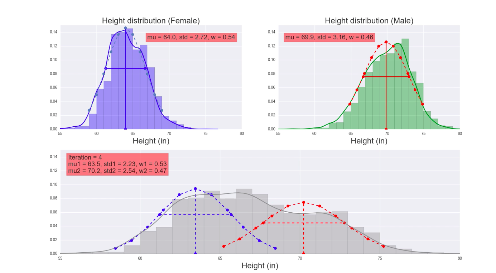

# Expectation Maximization

This repo contains the code associated with the project described on my [Blog](http://ketanscorner.com) here: [Expectation Maximization](http://ketanscorner.com/?p=1).

The project is a short tutorial designed to help build intuition for how the expectation maximization algorithm works using a simple problem based on real world data.  The data I used for the project was from the national longitudinal survey.  In this repo, I've replaced this data with some manufactured data.  

Files:  
* exp_max_sim.py - python file that runs a simulation and animation of the EM algorithm
* sample_data.csv - some manufactured gender/height data
* EM_algorithm.key - a few slides associated with this project (please see my  [blog post](http://ketanscorner.com/?p=1)  for more information)

Screenshot of animation:  

